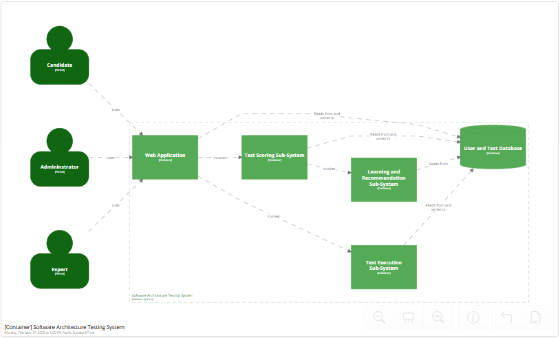

## Architecture Principles
A few core architecture principles to make sure that our architecture and system design align with strategic business objectives and existing systems' qualities.  [Placeholder]

| Principle              | Description                    |
| ---------------------- | ------------------------------ |
| Reuse over Buy over Build | We prefer to use existing solutions if they provide the necessary support to address business needs. Otherwise, we look first at vendor or open-source alternatives before developing custom software ourselves. 
| Separation of Concerns | Divide the components of the system into specific features so that there is no overlapping among the components' functionality. This will provide high cohesion and low coupling. This approach avoids the interdependency among components of the system which helps in maintaining the system easy.
| Cloud over Self Hosted | We minimize the dependencies on hardware resources and cost while increasing agility and efficiencies by leveraging SaaS, PaaS, and IaaS hosting platforms over owned data center hosting.

## Architecture Component Model
The system architecture consists of five subsystems responsible for Administration, Running the Tests, Assessment and Scoring, Learning and Recommendation as well as Candidate Status.  The existing system will be extended with an RAG approach to enhance large language models (LLMs) through query-dependent retrievals based on the architectural test relevant context.

## Main Architectural Quanta and Qualities
- User and Test Administration Sub-System
  - Availability
  - Security
  - Performance
- Testing System
  - Availability
  - Scalability
  - Performance
- Learning and Recommendation System
  - Accuracy
  - Reliability
- Candidate Status and Certification System
  - Scalability
  - Security

## User and Test Administration Architecture
The Administration architecture will be modified by adding AI model training functions allowing designated expert users to introduce "best" answers to the RAG model and case study context with "preferred" solutions.  The new user interface functions and integration into the AI data Pipeline will be added to the current administration application subsystem.

## Learning and Recommendation System Architecture 
The new Learning and Recommendation System will be added and integrated into the other sub-systems: ... .

