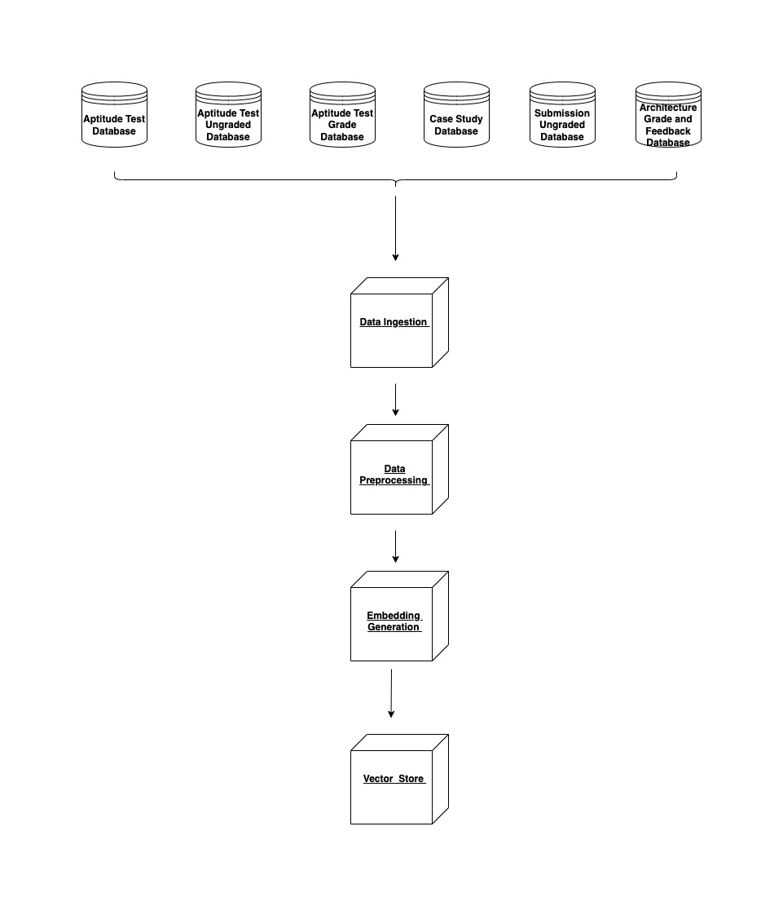

## Title: 

005: Data Pipeline for RAG's Knowledge Base

## Status: 

Proposed

## Context:

There are six data resources that can be included in the data pipeline for RAG's knowledge base: the aptitude test database, the ungraded aptitude test database, the aptitude test grade database, the case study database, the ungraded submission database, and the architecture grade and feedback database. We need to decide which of these resources should be ingested.

## Decision:

We will ingest all six resources into RAG's knowledge base.

## Consequences:

Different format conversions, data validation, cleaning, text preprocessing, data transformation, embedding models, and storage solutions should be designed to handle the diverse data from the six different resources.

